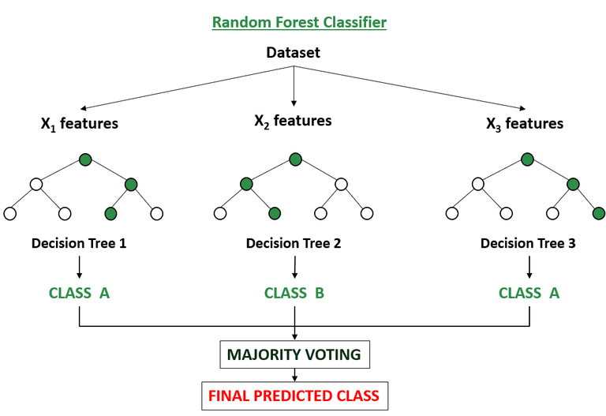

<h2>THIS IS A PREDICT MODEL</h2>

<h2>NOTE !!!!</h2>

You can extract features of objects

But you preprocess the data first

If you recognize colors like me, switch back to color_BGR

In general, depending on the data and how you process it, you will have a great model for you to use

GOOD LUCK !!!